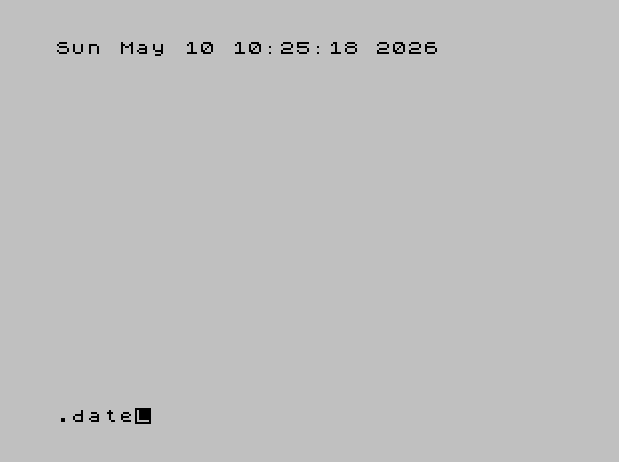

# RTC.SYS Driver for ESXDOS compatible with the MR.GLUK RTC standard.

RTC.SYS is a real-time clock driver for ESXDOS.

Supported RTC chips:
  - DS1285, MC146818, BQ3285, KR512VI1, etc

Compatible with the GLUK RTC standard.

Installation:
  Copy or replace the RTC.SYS file in the following directory
  on the SD card:

#    /SYS/

